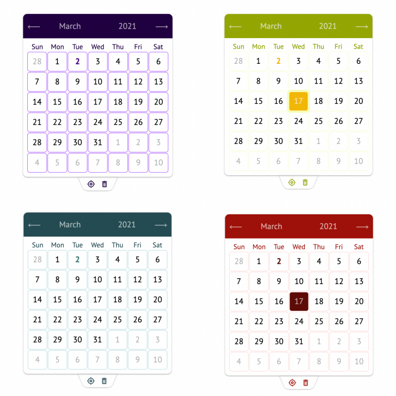

# Vanilla JS Calendar



VanillaJS calendar with out external dependencies. Used: state management on Proxy, Event Emitter, simple DOM library, Intl for translation, typescript, sass.

## Example

```
cd example
yarn install
yarn start
```

Colors can be changed in style/\_custom-variables.scss
